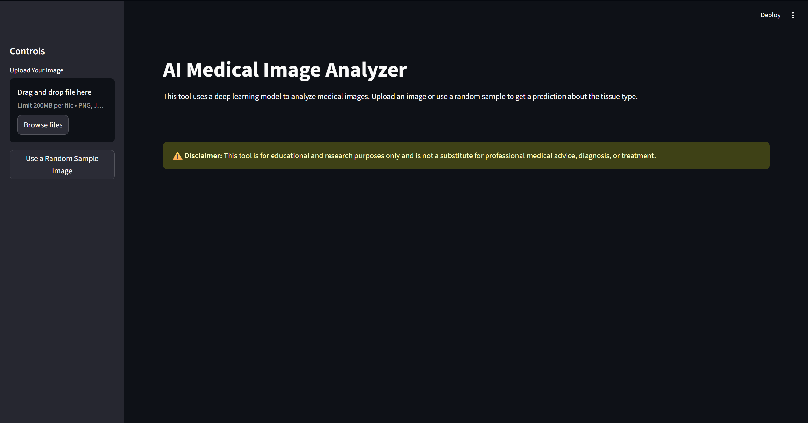

# 🔬 AI Multi-Cancer Detection

### A Hybrid Vision Transformer & Ensemble AI that can classify 20 different tissue types across 5 major cancers with **96% accuracy**.


---

This project is a complete, end-to-end system for medical image analysis. It leverages a state-of-the-art deep learning architecture to provide not just predictions, but also "whitebox" explanations for its reasoning.

## ✨ Live Demo

The entire system is wrapped in a user-friendly web application built with Streamlit. You can upload an image (or use a random sample) and get a live analysis in seconds.



---

## 🚀 Key Features

- **Multi-Domain Classification:** Trained on 5 diverse cancer datasets: **Lung, Breast, Brain, Blood, and Colon**.
- **Hybrid AI Architecture:**
    - **Vision Transformer (ViT):** Acts as a powerful feature extractor to understand the global context of an image.
    - **Stacking Ensemble:** Combines `RandomForest` and `XGBoost` for robust and highly accurate classification.
- **Explainable AI (XAI):** Uses **SHAP** to generate force plots, explaining the *why* behind every prediction.
- **Fully Automated Pipeline:** From data download to model training and evaluation, every step is scripted.
- **Interactive Front-End:** A clean, intuitive Streamlit application for real-time analysis.

---

## 🛠️ Tech Stack

| Technology | Purpose |
| :--- | :--- |
| **Python** | Core programming language |
| **PyTorch** | For running the Vision Transformer model |
| **Timm** | Accessing pretrained deep learning models |
| **Scikit-learn** | Building the ensemble classifier |
| **XGBoost** | High-performance gradient boosting |
| **SHAP** | Model explainability |
| **Streamlit** | Building the interactive web application |
| **Pandas & NumPy** | Data manipulation |
| **Kaggle API** | Automated dataset download |

---

## ⚡ Quickstart Guide

Get the entire project running in just a few steps.

### 1. Setup Your Environment

**a. Clone the repository:**
```bash
git clone <your-repo-url>
cd MultiCancerDetection
```

**b. Create and activate a virtual environment:**
```bash
python -m venv .venv && source .venv/bin/activate
```
*(Use `.venv\Scripts\activate` on Windows)*

**c. Install all dependencies:**
```bash
pip install -r requirements.txt
```

**d. Configure your Kaggle API token:**
   - Download `kaggle.json` from your Kaggle account.
   - Place it in `~/.kaggle/` (Linux/macOS) or `C:\Users\<Your-Username>\.kaggle\` (Windows).

### 2. Run the Automated Pipeline

Execute these scripts in order from the project's root directory.

**Step 1: Download & Prepare Data**
```bash
python src/download_and_prepare.py
```

**Step 2: Generate ViT Embeddings (GPU Recommended)**
```bash
python src/embeddings.py
```

**Step 3: Train the Ensemble Model**
```bash
python src/train.py
```

### 3. Launch the App!

After training is complete, launch the interactive demo.
```bash
streamlit run app.py
```
Your browser will open with the application ready to go.

---

## 📈 Final Results

The model achieved a **95.7% weighted F1-score** on a held-out test set of 4,725 images.

